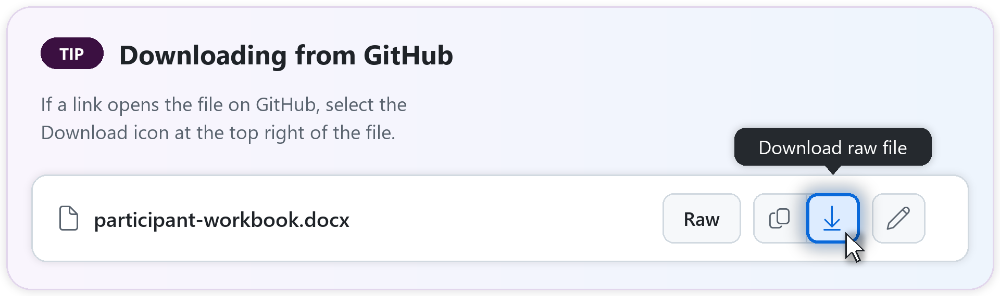

# Pre-Workshop Readiness Checklist

> In this workshop **the ~25 attendees sign in with their own work accounts** in their organization's
> Microsoft 365 tenant, while the **facilitator demos from a separate demo tenant**. Attendees run
> Exercise 1 on **their own mail, calendar, and Teams** and use the **Zava sample files** for everything
> else, so there are no attendee accounts to provision or data to seed. Readiness is mostly the
> **host's** job (licenses, Cowork access, browser settings, the sample files) plus the
> **facilitator's** demo account.

## Preparation timeline

| When | Owner | Do this |
| --- | --- | --- |
| **T − 3 weeks** | Host / admin | Confirm Microsoft 365 Copilot licenses and **usage-based billing** for the attendee tenant, create a **Cowork spending policy** for the attendee group, and turn on **Cowork Browsing** for that group. Estimate cost and set spend guardrails (see [Cost planning](#cost-planning)). Book the room and Wi-Fi. |
| **T − 2 weeks** | Host / admin + facilitator | Collect the **attendee list** and add everyone (plus **1–2 licensed spare accounts**) to the workshop security group. In the **facilitator's demo tenant**, allow **Work IQ MCP write operations** and set up the seed sender accounts ([seed-content.md](seed-content.md#how-to-load-it)). Confirm the demo tenant is Cowork-ready. |
| **T − 1 week** | Facilitator | **Full dry run** of all 8 exercises with a licensed account in the attendees' tenant (a spare is fine), checking against the [answer key](facilitator-answer-key.md). **Record the demo videos** (Exercises 2–8, the UI walkthrough, and the weak vs. strong prompt) from your demo account and insert them on the deck's **Demo** slides ([how](facilitator-guide.md#before-you-start)). Stage `zava-sample-knowledge.zip` in the shared Teams/SharePoint folder. Send attendees a joining note (bring a laptop, not a phone); the [participant email](../communication/participant-email.html) is ready to paste into Outlook. **Before you send either email, check its download links:** open each one in an InPrivate window. It must download the file without a GitHub sign-in. If you get a sign-in page (the kit repo is private), replace the link with your Teams/SharePoint copy. Maintainers can run `tools/check_download_links.py --online` to check every link in the decks and emails at once. |
| **T − 1 to 2 days** | Facilitator | Load the **seed emails, meetings, and Teams chat** into **your demo account only** with VS Code and the Work IQ MCP server ([seed-content.md](seed-content.md#how-to-load-it)), so your live Exercise 1 demo has a rich command center, then **record the Exercise 1 demo video** from it. Attendees need no seed. |
| **T − 1 day** | Host / admin | With a spare or test account in the attendees' tenant, run the smoke test **and** the Exercise 3 browser prompt in an **Edge** profile (accept the consent notice). Print the [quick-reference card](../participant/quick-reference-card.docx). |
| **Day of, T − 45 min** | Facilitator + proctors | Test the projector, Wi-Fi, and demo tenant. Open the deck, the answer key, and a ready Cowork session. Brief proctors on the [troubleshooting triage](facilitator-guide.md#troubleshooting-triage-hand-to-proctors). |
| **Day after** | Host | **Pause or delete** Exercise 1 and 7 schedules (or have attendees do it), send the [after-the-workshop pack](../participant/after-the-workshop.md) and survey, and review usage and spend. |

## Cost planning

Cowork is **usage-billed**, so 25 people running Deep Research, dashboards, and automations at once
adds up. Before the session:

- **Set up billing:** [aka.ms/CopilotCredits/Setup](https://aka.ms/CopilotCredits/Setup)
- **Estimate the cost:** the [Customer cost estimator](https://aka.ms/CustomerCoworkEstimator) and the
  Copilot Credit Planning Model ([aka.ms/CopilotCreditPlanningMod](https://aka.ms/CopilotCreditPlanningMod)).
  Estimate for ~25 users × 8 exercises, plus spares, the facilitator's dry run, and the Exercise 1 and
  7 schedules that keep running until paused.
- **Set guardrails:** set a per-user credit limit and alerts on the workshop spending policy, and plan to
  **pause every schedule the day after**. A low limit doesn't block access: people can work until they
  reach it. To remove someone's access, take them out of the policy's scope instead.
- **After the event:** remove the workshop group from the spending policy (or delete the policy) if the
  accounts shouldn't keep Cowork access.
- **Reduce cost:** leave the model picker on **Let Cowork decide** and reasoning effort on the default
  unless an exercise calls for more.

## Plan B — if Cowork is down for the whole room

1. **Don't troubleshoot for more than 10 minutes.** Announce the switch.
2. **Demo from the facilitator tenant**, projected. Run each exercise live while the room follows the
   workbook, and use the [answer key](facilitator-answer-key.md) as the "expected result" handout.
3. **Keep the non-Cowork pieces hands-on:** Exercise 8 (Agent Builder) and the Copilot Chat
   comparison work without Cowork, if Microsoft 365 Copilot is up.
4. **Turn practice into judgment:** have attendees critique the demo outputs with the answer key and
   the [responsible-use checklist](../reference/06-responsible-use.md#quick-pre-send-checklist).
5. **Reschedule a 90-minute hands-on follow-up** for Exercises 1, 3, 4, and 7, with the same
   accounts and sample files.

## For the host / tenant admin (do this before the workshop)

- [ ] Confirm each attendee's **own work account** has a **Microsoft 365 Copilot** license. No
      workshop accounts are needed; keep **1–2 licensed spare accounts** in case someone's access fails.
- [ ] Put the attendees (and spares) in a **security group**, e.g. *Cowork Workshop Attendees*.
- [ ] **Usage-based billing** set up, with a **spending policy that selects Cowork** and is scoped to
      that group. The spending policy is what **grants access** to Cowork (the older *Agents → Cowork*
      setting no longer controls access). Add an estimate and guardrails (see [Cost planning](#cost-planning)).
- [ ] **Cowork Browsing** (for the Exercise 3 browser task): in the Microsoft 365 admin center, **Copilot →
      Settings → View all → Cowork settings → Allow browser access**, and allow it for the attendee
      group. It's **off by default**. Also check that web filtering doesn't block **dol.gov** or
      **lni.wa.gov**, and that the Edge policy **CopilotCoworkToolActionsEnabled** isn't set to
      Disabled on managed laptops. Details: [reference/10-cowork-browser.md](../reference/10-cowork-browser.md).
- [ ] Attendee laptops have **Microsoft Edge 152 or later**. Each attendee will sign in to an **Edge
      profile** with their work account (InPrivate and guest windows can't run browser tasks) and
      check that **Allow Cowork to take actions on your behalf** is on in Edge **Settings**.
- [ ] Confirm the **facilitator's own (demo) tenant** is Copilot- and Cowork-ready for live demos, and
      that **Work IQ MCP write operations** are allowed there so the facilitator can load the seed
      ([seed-content.md](seed-content.md#how-to-load-it)). The change can take 24 hours.
- [ ] **Stage the sample data:** upload **zava-sample-knowledge.zip** from `sample-knowledge/` (the one zip; it holds the six Word and Excel sample files,
      in an `ai_hr_cowork_workshop` folder) to a shared location every attendee account can reach (a **Teams channel** or **SharePoint
      library**), so attendees can copy them into their own OneDrive. Getting the files from GitHub?
      If a link opens the file on GitHub, select the **Download** icon (**Download raw file**) at the
      top right of the file (see the picture after this list).
- [ ] **No attendee seed data.** Exercise 1 (Executive Command Center) runs on each attendee's **own**
      mail, calendar, and Teams; Cowork only reads what that person can already see, and the results
      stay private to them. Tell attendees this in the invitation (the
      [participant email](../communication/participant-email.html) does).
- [ ] **After class:** remind attendees (or clean up centrally) to **pause/delete the schedules**
      created in Exercises 1 and 7 so they stop consuming usage.
- [ ] *(Optional)* **Frontier** enrollment — only if you want to demo the built-in **App** skill;
      not required for the core exercises.
- [ ] Confirm any **model/subprocessor policy** (e.g., use of Anthropic models as a subprocessor) so
      you can tell attendees what's allowed in the model picker.

## For attendees (during setup, first 20 minutes)

- [ ] I signed in with **my own work account** at **https://copilot.cloud.microsoft**
      in **Microsoft Edge**, in an Edge profile signed in with that account.
- [ ] I can see the **Cowork** toggle at the top (next to **Chat**).
- [ ] I ran a smoke-test prompt in Cowork and got a response (e.g., *"Give me a one-sentence hello."*).
- [ ] I copied the **sample-knowledge** files from the shared location into my **own OneDrive**
      folder **Documents/ai_hr_cowork_workshop** (I created it in OneDrive → My files → Documents).
- [ ] I set my **custom instructions**: **Customize → Preferences → Customize instructions for Cowork**
      (workbook Setup step D).
- [ ] I'm on a **laptop/desktop** (custom skills aren't supported on mobile).

## Data and shared-tenant etiquette

- **Exercise 1 uses your real mail, calendar, and Teams.** Cowork sees only what you can already see,
  and the results stay in your account. **Don't project or screen-share** your Exercise 1 results.
- **Every other exercise uses the fictional Zava sample files.** Don't add real employee records or
  personal data to the exercise files, prompts, or skills.
- Your **OneDrive, drafts, and skills** are tied to **your account**. Keep any **custom skill you build
  "Only you"** (or add your initials to the name), so the tenant doesn't get 25 identically named skills.
- **Send nothing to anyone else:** save drafts, or send only to yourself.

## If something isn't ready

- **Account/license/Cowork issue** → the host lends a **spare account** (the attendee uses the Zava
  files; Exercise 1 will show little in a spare); meanwhile the attendee
  follows the **facilitator demo** (fallback follow-along), checking results against the
  [facilitator answer key](facilitator-answer-key.md), so they still learn the flow.
- **Can't find the sample files** → point to the staged Teams/SharePoint copy; a proctor helps copy
  them to OneDrive.
- Keep a **parking lot** for any tenant issue so the group stays on schedule.
- **Whole room blocked** (Cowork or tenant down)? Switch to [Plan B](#plan-b--if-cowork-is-down-for-the-whole-room).

## Quick reference: what each prerequisite unlocks

| Prerequisite | Needed for |
| --- | --- |
| Licensed work account (Microsoft 365 Copilot) | All of Cowork |
| Cowork spending policy (usage-based billing) | Access to Cowork, and running tasks (Cowork is usage-billed) |
| Cowork Browsing + Edge 152+ signed in with your work account | The Exercise 3 browser task |
| Staged sample files + OneDrive | Grounding exercises; saving custom skills |
| Your own mail, calendar, and Teams | Exercise 1 (the facilitator demos with [seed content](seed-content.md)) |
| Laptop/desktop | Building custom skills (not available on mobile) |
| Frontier (optional) | The built-in **App** skill only |
