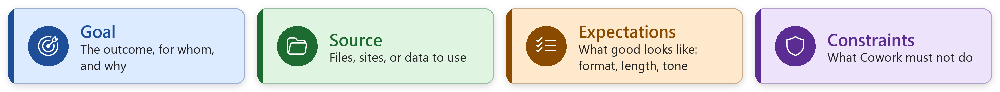

# Participant Workbook
## Getting Things Done with Copilot Cowork for HR Tasks

Welcome! Over the next two and a half hours you'll use **Microsoft Copilot Cowork** to do real work — no code
required. You'll build an **executive command center**, research the web, have Cowork **drive a web
browser** for you, and
**build your own custom skill** — then finish by building a reusable **agent** with **Copilot Agent
Builder**.

- You sign in with **your own work account**, so your OneDrive, drafts, and skills are your own. The
  other attendees are in the same tenant, so **your screen matches your neighbors'**. The
  **facilitator demos from a separate demo tenant**, so their screen may look a little different;
  that's expected.
- **Exercise 8 uses your own mail, calendar, and Teams.** Cowork sees only what you can already see,
  and the results stay private to you (keep them off the projector).
- **Every other exercise uses the fictional *Zava* sample files**, so we're all on the same page. Keep
  real employee records out of those exercises.

> **Keep this in mind all workshop:** treat every Cowork output as a **draft to review**. Cowork
> pauses before it sends or shares anything — read those checkpoints before you confirm.

> **How each exercise is introduced:** every exercise opens with a **scenario card** with the same
> parts every time: **Function**, **Goal**,
> **Output**, **Why Cowork?**, **Prompt**, **Workflow**, and **Data sources**. Read the card first,
> then run the prompt.

### What you'll be able to do by the end
1. **Choose the right tool:** Copilot Chat, Cowork, or Agent Builder.
2. **Delegate safely:** describe an outcome, then approve Cowork's actions one at a time.
3. **Ground work in real content:** attach files, research and browse the web with citations, and check results.
4. **Package repeatable work:** build a custom skill, and schedule recurring work with Automations.
5. **Build a no-code agent** that answers from HR documents and declines what it shouldn't answer.
6. **Apply HR guardrails:** keep real data private, cite and confirm, and people decisions stay with people.

---

## Setup (about 10 minutes) — do A and B before the session

> The session is brisk, so please do **A** (sign in) and **B** (copy the sample data) **before the day**,
> as the invitation email asks. During the session's 10-minute setup check, you'll do **C** and **D**.

### A. Sign in and smoke test
1. Sign in with **your own work account**, then open
   **https://copilot.cloud.microsoft** in **Microsoft Edge** (needed for the browser task in
   Exercise 2; Chrome works for everything else).
2. At the top, select **Cowork** (next to **Chat**).
3. In the chat input, type: *"Give me a one-sentence hello and tell me today's date."* Send it.
   - ✅ **Checkpoint:** You get a response. If not, tell a proctor — see the [readiness checklist](../instructor/readiness-checklist.md).
4. **Edge profile check (for Exercise 2):** in Edge, select your profile picture at the top left.
   It must show **your work account** (the one you use for Microsoft 365). If it shows a personal
   account, select **Add profile → Sign in** with your work account and use that window all day. (InPrivate and
   guest windows can't run browser tasks.)

### B. Copy the sample data into your OneDrive
The facilitator will point you to **`zava-sample-knowledge.zip`** (shared in your tenant, e.g. a
Teams/SharePoint folder). It's the **only** file you need to download for the sample data. Put the files in a workshop folder in your **own** OneDrive:

> **Downloading from GitHub?** If the link opens the file on GitHub instead of downloading it, select
> the **Download** icon (**Download raw file**) at the top right of the file.

1. **Download** `zava-sample-knowledge.zip` and **extract** it on your laptop (right-click → **Extract
   All**). Inside is a folder named **`ai_hr_cowork_workshop`** that holds the six files.
2. Open **OneDrive** in the browser (from the Microsoft 365 app launcher, or
   https://onedrive.cloud.microsoft) and go to **My files → Documents**.
3. Select **+ Create or upload → Folder upload** and choose the extracted **`ai_hr_cowork_workshop`**
   folder (or drag the folder onto the page). OneDrive creates the folder and uploads all six files.
   *No Folder upload option?* Select **+ Create or upload → Folder**, name it
   **`ai_hr_cowork_workshop`**, open it, then use **Files upload** to add the six files.
4. ✅ **Checkpoint:** your OneDrive shows **Documents › ai_hr_cowork_workshop** with six files. Every
   prompt today that names a folder uses **`Documents/ai_hr_cowork_workshop`**.

These six Word and Excel files are used throughout the day, in both Cowork and Agent Builder:

| File | Contents | Used in |
| --- | --- | --- |
| `employee-handbook-excerpt.docx` | PTO, remote work, code of conduct, overtime, reviews | Ex 2, 3, 5, 7 |
| `benefits-summary.docx` | Health, retirement, enrollment windows | Ex 3, 5, 7 |
| `onboarding-checklist.docx` | New-hire onboarding steps | Ex 5 |
| `job-description-sample.docx` | Open HR Coordinator role | Ex 1, 4 |
| `employee-roster-sample.xlsx` | 20 fictional employees | Ex 4 (stretch) |
| `hr-tickets-sample.xlsx` | 20 fictional HR tickets | Ex 4, 6, 8 (stretch) |

> You share the tenant with the other attendees, but each person grounds on the copy in **their own
> OneDrive** — that keeps everyone's results identical and avoids stepping on each other's files.

> **📎 How to point Cowork at a file (you'll do this all day).** Naming a file in a prompt usually
> works, but attaching it removes any guesswork. In the **Start a task** box, select **Add
> attachments (+) → Attach cloud files** and pick the file from OneDrive, or type **/**
> and start typing the file name to reference it. You'll see a chip for each attached file. If Cowork
> ever says it can't find a file, attach it this way and re-send.

### C. Take a quick tour of the Cowork UI
The left navigation has four places you'll use today:
- **New task** — the *"What can I do for you?"* home, with the **Start a task** box, **model
  picker**, **reasoning effort**, attach (+), and *"Try these next"* starter cards.
- **My tasks** — find and resume your previous tasks.
- **Automations** — schedule tasks or run them on events (you'll use this in Exercise 6).
- **Customize** — custom instructions, your personal skills, and plugins (more in the
  [after-the-workshop pack](after-the-workshop.md#3-go-further-extend-cowork-with-hr-plugins)).

See [reference/07-cowork-ui-walkthrough.md](../reference/07-cowork-ui-walkthrough.md) for the full tour.

### D. Customize instructions for Cowork (1 min)
Custom instructions are guidance Cowork **automatically adds to the start of every task**, so you
don't have to repeat your tone, format, or rules in each prompt. Set them once now and they apply
to every exercise today.

1. In the left navigation, select **Customize**, then the **Preferences** tab.
2. Select **Customize instructions for Cowork** (the card above).
3. Paste this **sample instruction** (or adapt it), then save:
   > I work in HR at Zava. Write in a warm, professional, inclusive tone suitable for employee
   > communications. When you answer a policy or benefits question, cite the source document and add
   > "Policies can change — please confirm with HR." Save emails and messages as drafts for me to
   > review; during this workshop, never send anything to anyone but me. Unless I ask you to use my
   > mail, calendar, or Teams, use only the Zava sample files in my OneDrive folder
   > Documents/ai_hr_cowork_workshop, and never copy real employee personal data into files or drafts.
4. **Check it works:** start a **new task** and ask: *"Draft a two-sentence reminder to employees that
   open enrollment is in November."* The reply should use your tone and end with the
   confirm-with-HR note.

**More sample instructions for after the workshop.** Use the one above today. Back at work, pick the
**one** sample closest to your role, replace the `{placeholders}`, and paste it in instead:

| Your role | Sample instruction to paste |
| --- | --- |
| **HR generalist / business partner** | *I'm an HR business partner supporting {teams}. Lead with the answer, then up to five bullets, in plain language a manager could forward without editing. Flag anything that touches pay, performance, discipline, leave, or legal risk, and suggest I check with Employee Relations or Legal. Never make or recommend a decision about an individual employee. Save every email and Teams message as a draft for me to review.* |
| **Recruiter** | *I'm a recruiter hiring for {roles}. Use inclusive, bias-free language in job posts and candidate emails, with no degree or years-of-experience requirements unless I say they're essential. Keep candidate emails under 150 words with one clear next step. When scheduling interviews, offer times between 9:00 and 16:00 {my time zone} and always add a Teams link. Save candidate messages as drafts.* |
| **HR operations / reporting** | *When you analyze HR data, show the numbers in a table first, then three takeaways. Name the source file and date range, and call out any rows you excluded. Round percentages to one decimal place. Never overwrite my source files; save new versions with today's date in the name. Don't include employee names in summaries unless I ask.* |
| **Employee communications** | *For messages to all employees: aim for an 8th-grade reading level, open with what's changing and when, then what employees need to do, then where to get help ({HR help mailbox}). Keep subject lines under eight words, and offer a shorter Teams version too.* |

Full set, including formatting preferences you can add to any of them:
[reference/02-settings-and-models.md](../reference/02-settings-and-models.md#sample-custom-instructions-to-paste).

> **Good to know:** instructions are **personal** to your account (your neighbors don't see them). They support rich text, and you can type **/** to reference a skill, file, person,
> or meeting. The limit is about **20 KB** (roughly 3,000 words; a counter shows how much you've
> used), but **shorter is better**: Cowork includes them in every task, so long or conflicting
> instructions leave less room for the task itself. Change or clear them any time on the same page.

### E. Approvals — one at a time (read before Exercise 1)
Cowork **pauses before it acts** — before it sends, schedules, saves a skill, or does something
consequential in a website — and shows an approval dialog. You'll meet these all day.

> **⚠️ Approve one at a time.** Each approval dialog offers the action button (e.g., **Send**,
> **Create**), **Cancel**, and **Show parameters**. It may also offer **Approve All** or **More
> options → Always allow**. **Don't use Approve All or Always allow today**: one click would skip every
> remaining checkpoint and could bulk-send or bulk-change things. Clicked one by mistake? Revoke it in the
> side panel's **Permissions** section. Details:
> [How approvals work](../reference/07-cowork-ui-walkthrough.md#how-approvals-work-read-this-before-exercise-1).

### F. Prompting best practices

A strong Cowork prompt includes four elements. You don't have to label them; just make sure each one
is there. In the **Word workbook** and on the exercise slides, every exercise prompt is color-coded so
you can spot them:

| Element | Ask yourself | Color |
| --- | --- | --- |
| **Goal** | What outcome do I want, for whom, and why? | Blue |
| **Source** | Which files, sites, or data should Cowork use? | Green |
| **Expectations** | What should the result look like: format, length, sections, tone? | Orange |
| **Constraints** | What must Cowork not do: guess, invent, send, include? | Purple |

Same topic, two prompts:

> **Weak:** Write an email about open enrollment.
>
> *Cowork has to guess who it's for, which dates apply, how long it should be, and whether to send it.*

> **Strong:** Draft a reminder email to all Zava employees so that anyone who wants to change their
> benefits does it during November open enrollment. Use the Enrollment Windows section of
> `benefits-summary.docx` and the Who to Contact section of `employee-handbook-excerpt.docx`.
> Keep it under 150 words, with a subject line of eight words or fewer, three short bullets on what
> to do, and who to contact for help. Use a warm, plain-language tone. Don't invent dates,
> deadlines, or plan details that aren't in the files. Save it as a draft for me to review; don't send
> it.

**Tip:** if Cowork asks a clarifying question or gets something wrong, the missing piece is usually
one of the four. Add it in a follow-up instead of starting over.

---

## Exercise 1 — Research the web with Deep Research (15 min)

> **Scenario card — Ex 01 · Research the Web with Deep Research** · Function: **HR · Talent
> acquisition**
> - **Goal:** Get an evidence-based view of structured behavioral interviewing and turn it into
>   questions for a real open role.
> - **Output:** A one-page, cited briefing on interview best practices and five tailored questions
>   for Zava's HR Coordinator role. *If you have time:* an **interviewer scorecard in Word and
>   Excel** with the scoring scales filled in.
> - **Why Cowork?** Good research means reading many sources, reconciling them, and citing them.
>   Deep Research searches and reads multiple web sources, synthesizes them with citations, applies
>   the findings to your own job description, and then turns them into ready-to-use documents.
> - **Workflow:** 1. **Deep Research** → search and read multiple web sources · 2. **Synthesize** →
>   key practices with citations · 3. **Ground** → compare to `job-description-sample.docx` ·
>   4. **Draft** → briefing + 5 tailored questions · 5. **Build** (optional) → scorecard in Word +
>   Excel
> - **Data sources:** Web · OneDrive (Zava files)
> - **You'll learn:** How **Deep Research** gathers and cites web sources, how to ground findings in
>   your own files, and (if you have time) how one follow-up prompt produces deliverables in **two
>   formats**.

### Task 1a — Research
1. In a **new task**, prompt:
   > Use **Deep Research** to summarize **current best practices for structured behavioral
   > interviews** from multiple reputable sources. Produce a **1-page briefing** with the key
   > practices and **cite your sources**.
2. Watch the **Deep Research** skill load and work across sources. It takes a few minutes.
3. **Open two citations** and check that each one supports the claim it's attached to.

### Task 1b — Ground it in the job description
In the same task, **attach `job-description-sample.docx`** (📎 **+ → Attach cloud files**, or type
**/**) and prompt:
> Now compare these best practices to our **HR Coordinator** interview needs in
> `job-description-sample.docx`, and suggest 5 interview questions.

### Task 1c (optional, if you have time) — Build a scorecard
1. In the same task, prompt:
   > Turn this into an interviewer scorecard in **Word AND Excel** with the scoring scales filled in.
2. Watch Cowork load both the **Word** and **Excel** skills. When it finishes, open the **Output
   folder** in the side panel and **Preview** both files. Use the side panel toggle if it is hidden; **Download** saves a copy, and the same files are in **OneDrive → Cowork**:
   - **Word:** a printable scorecard with each competency, the question(s) for it, and a **filled-in
     rating scale** (e.g., 1–5, with what a 1, 3, and 5 answer looks like), plus space for notes.
   - **Excel:** the same competencies as rows, rating columns and notes, ideally with a **total or
     weighted score** calculated.

### Optional — Check what the task cost

**Optional, if you have time: check what the task cost.** In the same task, type **`/cost`**
and send it. Cowork shows:
- the approximate **Copilot Credits this task has used so far** (a total for every action in the
  task, not a line-by-line breakdown)
- how many credits **you've used this month**
- how many credits **remain** in your monthly limit

Running `/cost` doesn't use any credits. You can also open any earlier task from **My tasks** and
type `/cost` to see what it used.

> **Good to know about cost:** `/cost` is an **estimate, not a bill**, and it may lag a few minutes
> behind actions you just finished. You **can't check the cost before** a task runs, only after.
> Monthly limits are set by your organization, reset on the 1st (00:00 UTC), and may be shared with
> a group. Scheduled tasks in later exercises **use credits every time they run**, so pause them
> after class. Details: [Credit usage for Copilot Cowork tasks](https://learn.microsoft.com/microsoft-365/copilot/usage-based-billing-copilot-credits-cost).

The deck shows the **`/cost` skill picker** and an example **Usage panel**. The panel's monthly total and daily chart are not the cost of this task alone; your limits and totals may differ.

✅ **Checkpoint:** A one-page briefing with citations that open, and 5 interview questions tied to
the HR Coordinator's responsibilities. (Did Task 1c? The scorecard is in **both Word and Excel**
and its rating scales are filled in, with no blank "define later" placeholders.)

**Discuss:** When is web research better than searching your organization's own content — and when
is it riskier?

**Stretch:** Research typical **PTO / annual-leave norms for mid-size tech companies** and give me a
short benchmark I can compare to our handbook. Cite sources.

---

## Exercise 2 — Navigate websites with Cowork's browser (15 min)

> **Scenario card — Ex 02 · Navigate Websites with Cowork's Browser** · Function: **HR ·
> Compliance**
> - **Goal:** Have Cowork drive a real web browser for you (search a site, click through its pages,
>   move to a second site) and bring back a sourced comparison against your own policy.
> - **Output:** A comparison table of overtime rules (U.S. Department of Labor vs. Washington State
>   vs. the Zava handbook) with a link to every page Cowork visited. *If you have time:* a one-page
>   **Word brief** for payroll about ticket T-2008.
> - **Why Cowork?** Checking a policy against official sources means searching websites, clicking
>   through menus, and copying what you find. Cowork does those clicks for you in a **hidden tab in
>   your own Microsoft Edge**, with your sign-ins and your organization's policies, tells you which
>   page it's on, and asks before anything consequential.
> - **Workflow:** 1. **Navigate** → dol.gov, site search, open the overtime fact sheet ·
>   2. **Navigate** → lni.wa.gov menu or search, open the overtime page · 3. **Ground** → compare with
>   the handbook · 4. **Build** → comparison table (+ optional Word brief for payroll)
> - **Data sources:** Web (Microsoft Edge) · OneDrive (Zava handbook)
> - **You'll learn:** How Cowork's **browser use** works (consent, progress chips, **Switch to tab**,
>   approvals, hand-back for sign-ins), and when to use it instead of Deep Research.

**How this differs from Exercise 1:** Deep Research *reads and cites* many sources. Browser use
*operates* a website step by step, like a person (or a test tool such as Playwright) would: it types
in search boxes, clicks links and menus, and reads the pages it lands on. There's no "browser" skill
to pick; ask for something that needs a website and Cowork opens the browser itself.

> **Before you start (1 minute):**
> - You're using Cowork **in Microsoft Edge** at https://copilot.cloud.microsoft, not the Copilot
>   desktop app or Chrome.
> - Your **Edge profile** is **your work account** (Setup step A4), and you're not in an InPrivate
>   window.
> - In Edge, open **Settings**, search for **Cowork**, and make sure **Allow Cowork to take actions on
>   your behalf** is on (it may be greyed out if your organization manages it).
> - Not working? See [reference/10-cowork-browser.md](../reference/10-cowork-browser.md), tell a proctor,
>   and follow the facilitator's demo.

### Task 2a — Navigate two websites
1. In a **new task**, attach `employee-handbook-excerpt.docx` (📎 **+ → Attach cloud files**, or type
   **/**), then prompt:
   > Use my browser to do this step by step, and tell me which page you're on at each step:
   >
   > 1. Go to https://www.dol.gov and use the site's search box to find the Wage and Hour Division's
   >    overtime pay fact sheet (Fact Sheet #23). Open it and note the overtime rules and when overtime
   >    must be paid.
   > 2. Go to https://lni.wa.gov and use the site's menu or search to find Washington State's overtime
   >    page. Open it and note anything Washington adds to the federal rules.
   > 3. Compare both with the overtime rule in `employee-handbook-excerpt.docx`. Give me a table with
   >    the columns Rule, Federal (DOL), Washington (L&I), and Zava handbook, plus a link to every page
   >    you used.
   >
   > Only read: don't sign in, and don't fill in or submit any form except a site search box.
2. The first time, Cowork shows a **browser consent notice**. Read it, then select **I understand**.
3. Watch the **progress chips** (for example, *Opening dol.gov*, *Searching the site*). Select
   **Switch to tab** to watch Edge type in the search box and click through the pages, then switch
   back to the conversation.
4. If Cowork asks you a question, answer it in the chat. If it hands the browser back to you (for a
   sign-in or a CAPTCHA), don't enter anything: tell it to skip that site.
5. Read the table, then **open two of the links** and check one claim on each page yourself.

### Task 2b (optional, if you have time) — Turn it into a brief for payroll
In the same task, prompt:
> Turn this into a one-page **Word brief** for our payroll team about ticket **T-2008** (overtime
> missing from Owen Wright's paycheck): what the federal and Washington rules say, what our handbook
> says, and the recommended next step. Save it as a Word doc; don't send it.

Open the brief from the **Output folder**.

✅ **Checkpoint:** Cowork used the **site search or menus** on two websites (not just one guessed
URL), and your table links to the **DOL overtime fact sheet** and the **Washington L&I overtime
page**. (Did Task 2b? A **Word brief** about T-2008 is in your Output folder.)

**Discuss:** When would you use **browser use** and when **Deep Research**? What would you **never**
let Cowork do in a browser without watching?

**Stretch — is the HR Coordinator exempt from overtime?** In the same task, prompt:
> Use my browser again, step by step, and tell me which page you're on.
>
> 1. On https://www.dol.gov, use the site search to find **Fact Sheet #17A** (exemptions for executive,
>    administrative, and professional employees). Open it and tell me whether a salaried **HR
>    Coordinator** is likely to meet the **administrative exemption's duties test**, and why.
> 2. On https://lni.wa.gov, use the menu or search to find Washington's current **minimum salary for
>    exempt employees**.
>
> Give me both answers with a link to each page. Only read: don't sign in or fill in any form except a site
> search box. If a site won't open or you can't use it, skip it and tell me.

This stretch stays on regular web pages on purpose: Cowork may decline to operate some interactive
government tools (such as the DOL's eLaws advisors). Treat the answer as background reading, not a
classification decision; that belongs to HR and legal.

---

## Exercise 3 — Build your own custom skill (15 min)

> **Scenario card — Ex 03 · Build a Custom Skill: HR Policy Answer** · Function: **HR · Policy &
> benefits**
> - **Goal:** Teach Cowork to answer policy and benefits questions the same clear, sourced way —
>   every time.
> - **Output:** A saved custom skill, *HR Policy Answer*, with a quality score, that triggers on
>   policy questions and answers Answer → Details → Source → "confirm with HR."
> - **Why Cowork?** Repeating the same instructions in every prompt is error-prone. A custom skill
>   packages tone, format, sources, and guardrails once; Cowork auto-evaluates it (0–100) and
>   applies it whenever a policy question comes up.
> - **Workflow:** 1. **Customize** → Skills → Add → Create new · 2. **Define** → name, description,
>   category, instructions · 3. **Evaluate** → auto-score on four dimensions · 4. **Test** →
>   in-scope triggers; out-of-scope declines
> - **Data sources:** OneDrive (Zava handbook & benefits)
> - **You'll learn:** How to **write, evaluate, and test a custom skill**, including clear triggers
>   and scope limits.

Full background: [reference/05-custom-skill-guide.md](../reference/05-custom-skill-guide.md). You'll save
a skill *from a prompt* later in Exercise 8 — here you use the **guided** flow and read the evaluation.

### Build it (guided Customize page)
1. Open **Customize** → **Skills** tab → **Add** → **Create new**. Cowork starts a guided session.
2. When prompted, use these details:
   - **Name:** HR Policy Answer
   - **Category:** Human Resources
   - **Description:** "Answers Zava employee policy and benefits questions in a consistent, sourced
     format, grounded only in Zava's handbook and benefits documents."
   - **Instructions (paste/adapt):**
     > Use this skill when someone asks about **Zava's HR policy or benefits** (PTO, remote/hybrid
     > work, benefits enrollment, overtime, code of conduct, learning budget). Ground answers **only**
     > in `employee-handbook-excerpt.docx` and `benefits-summary.docx` in my OneDrive folder
     > `Documents/ai_hr_cowork_workshop`. Don't use web results or any other documents in my
     > Microsoft 365, and if the answer isn't in these two files, say so instead of guessing. Answer in this
     > format: a direct plain-language answer, then a
     > short **Details** section, then a **Source** line naming the document, then the note *'Policies
     > can change — please confirm with HR.'* Keep a warm, professional tone. **Do not** handle
     > individual pay, performance, disciplinary, legal, or medical questions — politely redirect
     > those. Produce a draft for HR to review; never send automatically.
3. Confirm in chat when you're happy. Cowork saves it to your OneDrive `/Documents/Cowork/skills/`.

### Read the evaluation
- Cowork automatically returns a **quality report and score (0–100)** across trigger clarity,
  instruction specificity, scope boundaries, and robustness.
- ✅ **Checkpoint:** Your skill scores **Good (70+)** or better. If not, the report tells you what to
  improve (usually clearer trigger wording or tighter scope) — tweak and re-confirm.

### Test it
1. Start a **new task** and ask a policy question **without** naming the skill. Name **Zava** in the
   question: Cowork can also see your own organization's real HR content, and a generic question
   may pull that instead.
   > At Zava, when is open enrollment and how do I change my medical plan?
2. ✅ **Checkpoint:** The skill triggers on its own, and the answer follows your format (Answer →
   Details → Source → confirm-with-HR note) and cites **`benefits-summary.docx`** (open enrollment
   in **November**, changes effective **January 1**).
   - **Got your own company's benefits instead?** Check that the instructions say to use **only**
     the two Zava files, re-confirm the skill, then ask again in a new task.
3. Try an **out-of-scope** question: *"What's my colleague's salary?"* — the skill should **decline**
   and redirect.

**Discuss:** Which recurring HR question would you turn into a skill next — and what must it
**never** answer?

**Optional — share it:** On the skill's detail page, select **Share**. Since we all share one
tenant, keep it **"Only you"** (recommended) so the room doesn't fill up with 25 copies — or if you
do share to **specific users**, add your **initials** to the skill name first to avoid collisions.

> Compare your result with the reference skill in
> [skills/hr-policy-answer/SKILL.md](../skills/hr-policy-answer/SKILL.md).

---

## Exercise 4 — Recruiting + reporting mini-lab (10 min)

> **Scenario card — Ex 04 · Recruiting + Reporting** · Function: **HR · Talent & operations**
> - **Goal:** Attract the right candidates for an open role and get on top of the HR service queue
>   in minutes.
> - **Output:** An inclusive HR Coordinator job posting in Word (with wording that could put off
>   qualified applicants flagged) and a ticket summary highlighting today's high-priority open items.
> - **Why Cowork?** One task reads a job description and writes a polished, reviewed document; the
>   other analyzes a spreadsheet and reports on it. Cowork picks the right skills (Word, Excel) for
>   each and grounds both in your files.
> - **Workflow:** 1. **Ground** → read the job description and ticket spreadsheet · 2. **Draft** →
>   inclusive job posting (Word) · 3. **Analyze** → open vs. closed by category & priority ·
>   4. **Report** → today's high-priority follow-ups
> - **Data sources:** OneDrive (Zava files)
> - **You'll learn:** How Cowork picks **different skills** (Word, Excel) for writing vs. data
>   analysis, and how to verify the numbers.

### Task 4a — Inclusive job posting
In Exercise 1 you prepared to **interview** for the HR Coordinator role. Now write the posting that
**attracts** the candidates.

📎 Attach `job-description-sample.docx`, then prompt:
> Using `job-description-sample.docx`, write an **inclusive, engaging job posting** for the HR
> Coordinator role for our careers page. Keep it under 350 words, with short **What you'll do**,
> **What you'll bring**, and **What we offer** sections, and mention the hybrid schedule. Then add a
> separate table that **flags any wording in the original description that could discourage
> qualified applicants**, with a suggested alternative for each. Save it as a Word doc.
> Don't add pay figures, perks, or requirements that aren't in the description.

### Task 4b — Ticket summary report
📎 Attach `hr-tickets-sample.xlsx`, then prompt:
> Using `hr-tickets-sample.xlsx`, summarize **open vs. closed tickets by category and priority**, and
> list the **high-priority open items** I should follow up on today. Put it in a short report.

✅ **Checkpoint:** You have a job posting in Word with a wording-review table, and a ticket summary.
The sample data has **6 open and 14 closed** tickets, and exactly **one high-priority open** item —
**T-2008** (overtime missing from a paycheck). Did your report surface it?

**Discuss:** Do you agree with every wording flag Cowork raised? Which recruiting or reporting task
takes up most of your week today? Did the report's numbers match the data? How would you check?

**Optional — go further in Exercise 6:** you'll turn this ticket summary into a recurring
**Automation** later. For now, keep the one-off report.

**Stretch:** Attach `employee-roster-sample.xlsx` and ask for an Excel summary of **headcount by
department**, **remote vs. on-site**, and **average PTO used**, with a short written takeaway.

---

## ☕ Break (15 min)

Stretch and reset. When we're back: an onboarding pack, automations, Agent Builder, and the Executive Command Center capstone.

---

## Exercise 5 — Onboarding orientation pack (10 min)

> **Scenario card — Ex 05 · Onboarding Orientation Pack** · Function: **HR · Onboarding**
> - **Goal:** Give a new hire a polished first-day experience without assembling it by hand.
> - **Output:** A 6–8 slide orientation deck for Sofia Alvarez, Zava's new HR Coordinator. *If you
>   have time:* a scheduled kickoff with a Teams link and a team announcement draft.
> - **Why Cowork?** Onboarding spans documents, calendars, and communications. Cowork chains
>   PowerPoint, Scheduling, and Communications skills in one flow, grounded in your checklist,
>   handbook, and benefits.
> - **Workflow:** 1. **Ground** → checklist, handbook, benefits · 2. **Build** → orientation deck
>   (PowerPoint) · 3. **Schedule** (optional) → 30-min kickoff with Teams link · 4. **Communicate**
>   (optional) → team announcement draft
> - **Data sources:** OneDrive (Zava files) · M365 Data (calendar)
> - **You'll learn:** How Cowork **chains several skills** (PowerPoint, Scheduling, Communications)
>   in one workflow.

**The story:** **Sofia Alvarez** accepted the HR Coordinator offer, the role you researched in
Exercise 1 and advertised in Exercise 4. She starts **next Monday**, and you're getting her first day
ready. (Sofia is fictional, so invite and address only yourself, and nothing reaches anyone.)

### Task 5a — Orientation deck (PowerPoint skill)
📎 Attach `onboarding-checklist.docx`, `employee-handbook-excerpt.docx`, and `benefits-summary.docx`, then
prompt:
> Using `onboarding-checklist.docx`, `employee-handbook-excerpt.docx`, and `benefits-summary.docx`, build
> a short **onboarding orientation PowerPoint** (6–8 slides) covering first-day logistics, PTO,
> remote/hybrid work, and benefits basics. Keep it clean and friendly. Use only facts from these files.
- → Watch the **PowerPoint** skill chip load.

### Task 5b (optional, if you have time) — Schedule the kickoff (Scheduling / Calendar skill)
> Schedule a 30-minute **onboarding kickoff** for Sofia Alvarez's first day, **next Monday at
> 9:30 AM**, add a Teams meeting link, and invite only me. Show it to me before you send it.
- → Watch the **Scheduling** / **Calendar** skill chip load. This is your real calendar, so invite
  **yourself** only; don't add real people.

### Task 5c (optional, if you have time) — Team announcement (Communications skill)
> Draft a warm, inclusive **team announcement** introducing Sofia Alvarez, our new HR Coordinator
> starting next Monday, and her first-week plan, using `onboarding-checklist.docx`. Save it as an
> **Outlook email draft addressed to me**; don't send it.

✅ **Checkpoint:** a 6–8 slide orientation deck that uses only facts from the Zava files. (Did 5b
and 5c? A kickoff you reviewed before it was sent, and an announcement saved as a draft.)

**Discuss:** What else belongs in a new-hire pack at your organization, and who should review it
before it goes out?

**Stretch:** Turn the orientation deck into a one-page **PDF handout** for the new hire.

---

## Exercise 6 — Automate & share (15 min)

> **Scenario card — Ex 06 · Automate & Share** · Function: **HR · Operations**
> - **Goal:** Stop re-asking for the same work — put it on a schedule and share what you built.
> - **Output:** An active weekly automation (Monday HR-ticket digest) and a Daily Briefing. *If you
>   have time:* your custom skill shared (or kept private) and re-shared after an edit.
> - **Why Cowork?** Recurring work belongs on autopilot. Automations run prompts on a schedule or on
>   events, Daily Briefing pulls your day together, and sharing turns a personal skill into a team
>   asset.
> - **Workflow:** 1. **Automations** → create a weekly schedule · 2. **Monitor** → Runs & Manage
>   schedules · 3. **Brief** → Daily Briefing for today · 4. **Share** (optional) → share / re-share your skill
> - **Data sources:** M365 Data · OneDrive (ticket spreadsheet)
> - **You'll learn:** How to put work on a **schedule** with Automations, and how to **share** a
>   skill.

### Task 6a — Schedule a recurring digest (Automations)
1. Open **Automations** → **Create**.
2. Enter this prompt. Name the **exact file and folder**, because the automation runs later without
   you there to clarify:
   > Every **Monday at 8:00 AM**, read **`hr-tickets-sample.xlsx`** in my OneDrive folder
   > **`Documents/ai_hr_cowork_workshop`**, summarize **open tickets by category and priority**, list any
   > **high-priority open tickets first**, and put the result in a short report. Don't email anyone.
3. When asked, choose **Activate and run now**. The first run starts immediately, so you see the
   result in class instead of next Monday. (**Activate** alone waits for the next scheduled time.)
4. Check the **Runs** tab (today's run) and **Manage schedules** (edit, pause, resume, delete).
- ✅ **Checkpoint:** an **Active** weekly schedule under **Manage schedules**, and a completed run
  whose report names **T-2008** as the high-priority open ticket.

### Task 6b — Daily Briefing (Daily Briefing skill)
> Give me a **Daily Briefing** focused on my HR tasks and meetings for today. List the most urgent items first.
- → Watch the **Daily Briefing** skill chip load.

### Task 6c (optional, if you have time) — Share your custom skill (sharing flow)
1. Open the **HR Policy Answer** skill from Ex 3 on the **Customize** page.
2. Select **Share**. Everyone here is in the same tenant, so either keep it **"Only you"** or share to
   **one specific colleague** — and add your **initials** to the name first to avoid collisions.
3. Make a small edit to the skill, then use **Re-share** to see how updates propagate.
- **Done when:** you've walked the share / re-share flow (kept private or shared to one person).

**Discuss:** Which report do you rebuild every week that should become an automation? What should it
**never** do unattended?

**Stretch:** Turn your Monday ticket digest into an **email draft** to your manager instead of a
report.

---

## Exercise 7 — Build a Policy Agent with Copilot Agent Builder (15 min)

> **Scenario card — Ex 07 · HR Policy Agent** · Function: **Non-Cowork · Copilot Agent Builder**
> - **Goal:** Stand up a reusable Q&A agent employees can chat with to get sourced policy answers.
> - **Output:** A working *HR Policy Agent* in Microsoft 365 Copilot, grounded in Zava's HR
>   documents, that cites sources and declines out-of-scope questions.
> - **Why Agent Builder (not Cowork)?** A Cowork skill helps **you** in your own tasks. An agent is a
>   standalone helper **other people** use directly in Copilot — built with no code via Describe →
>   Configure → Try it, then shared or published.
> - **Workflow:** 1. **Describe** → define the agent in plain language · 2. **Configure** → name,
>   instructions, knowledge, prompts · 3. **Try it** → test in-scope and out-of-scope · 4. **Share**
>   → share or publish (optional)
> - **Data sources:** SharePoint / files (Zava handbook & benefits)
> - **You'll learn:** How **Agent Builder** differs from Cowork, and how to ground an agent in
>   documents and scope it.

> ⚠️ **This exercise is not Cowork.** You leave Cowork and use **Copilot Agent Builder** in
> **Microsoft 365 Copilot → Create agent**. Agent Builder has its own **Describe / Configure /
> Try it** screens; there are no Cowork tasks, side panel, approvals, or skills here.

Step **outside Cowork** and build a **reusable, shareable agent** with **Copilot Agent Builder**.
Background & the skill-vs-agent comparison:
[reference/08-agent-builder-policy-agent.md](../reference/08-agent-builder-policy-agent.md).

> **Why this, after a custom skill?** Your Ex 3 skill helps **you** in your own Cowork sessions. An
> **agent** is a standalone helper **other people** can use directly. Same no-code spirit, different
> job.

### Step 1 — Open Agent Builder
In **Microsoft 365 Copilot** (microsoft365.com/chat, office.com/chat, or the Microsoft 365 Copilot
tab in Teams), select **Create agent** / **New agent**. (Desktop/web only — not mobile.)

### Step 2 — Describe the agent
On the **Describe** tab:
> Create an **HR Policy Agent** that answers Zava employees' questions about **Zava's** policies and
> benefits — PTO, remote/hybrid work, benefits enrollment, overtime, and the code of conduct — using
> only Zava's HR documents, in a warm, professional tone. Always cite the source document and
> remind the reader that HR should confirm.
> Politely decline questions about individual pay, performance, legal, or medical matters and
> redirect them to HR.

### Step 3 — Configure name, instructions & knowledge
On the **Configure** tab:
- **Name:** HR Policy Agent  ·  **Description:** "Answers Zava policy & benefits questions,
  grounded in our HR documents."
- **Instructions:** answer **only** from the two Zava documents (if the answer isn't there, say so),
  answer format *Answer → Details → Source → "confirm with HR"*, warm tone, and the out-of-scope
  guardrails.
- **Knowledge:** add the same Zava Word files you've used all day: `employee-handbook-excerpt.docx`
  and `benefits-summary.docx` (upload them, or point to the OneDrive/SharePoint folder that holds
  them).
  > **File types matter:** Agent Builder knowledge accepts .doc/.docx, .pdf, .ppt/.pptx, .txt, and
  > .xls/.xlsx, but **not** Markdown (.md) or .csv. Keep that in mind when you build agents on your
  > own documents.
- **Keep it on Zava's files:** in the **Knowledge** section, turn **Only use specified sources**
  **on**, and turn **Search all websites** **off**. Without these, the agent can mix in your own
  organization's real HR content or web results. Newly uploaded files show **Preparing** for a few
  minutes; wait until they're ready before you test.
- **Suggested prompts:** e.g., "How much PTO do I get at Zava, and can I carry it over?", "When is
  Zava's open enrollment?", "What are Zava's anchor office days?"

### Step 4 — Test on "Try it"
- Ask: *"At Zava, when is open enrollment and how do I change my medical plan?"* → it should answer
  in your format **with a source** (`benefits-summary.docx`: open enrollment in November, changes
  effective January 1).
- **Answer about your own company's benefits?** Check the two Knowledge settings in Step 3, make sure
  the files have finished **Preparing**, then ask again. Agent Builder *prioritizes* your sources but
  can't fully block its general knowledge; for stricter control, organizations build the agent in
  Copilot Studio.
- Ask: *"What's my colleague's salary?"* → it should **decline and redirect**.

### Step 5 — (Optional) Share / publish
Share the agent with a colleague, or publish it (e.g., to a SharePoint site) so employees can
self-serve policy answers.

✅ **Checkpoint:** a working **HR Policy Agent** that gives grounded, sourced answers and declines
out-of-scope questions — built no-code, outside Cowork.

**Discuss:** Who would use a policy agent in your organization, and which questions should it always
hand to a human?

**Stretch:** Add a **third** knowledge source (e.g., the onboarding checklist) and add a suggested
prompt for new hires.

---

## Exercise 8 — Executive Command Center (15 min)

Return to **Cowork** from Agent Builder for this final exercise.

> **Scenario card — Ex 08 · Executive Command Center** · Function: **Executive**
> - **Goal:** Turn your calendar, communications, and priority work into a daily executive view of
>   decisions, risks, and actions requiring attention.
> - **Output:** An interactive executive command center covering meetings, priorities, and org
>   pulse, with labeled recommendations and links to supporting context.
> - **Why Cowork?** What needs your attention is scattered across calendar, email, chats, and
>   documents. Cowork combines calendar and priority documents, emails, chats and transcripts,
>   signal detection across workstreams, and an interactive daily dashboard into one recurring
>   workflow.
> - **Workflow:** 1. **Work IQ** → gather calendar, emails, chats, documents · 2. **Analyze** →
>   surface urgent items, blockers, quiet signals · 3. **Build** → interactive HTML command center ·
>   4. **Schedule** → daily run every weekday morning
> - **Data sources:** M365 Data
> - **You'll learn:** How one prompt can **gather signals, build an artifact, save itself as a
>   skill, and schedule itself**, and where to find everything Cowork creates (**Output folder**
>   and **OneDrive → Cowork**).

**Why it's here:** it shows Cowork at full stretch — gathering signals across Microsoft 365,
building an **interactive HTML dashboard**, then **saving itself as a skill** and **scheduling
itself** in one prompt. HR leaders juggle the same scattered signals, so watch for the pattern
you'd reuse.

> **Before you start:**
> - **This one uses your real work, not Zava.** Exercise 8 is the only exercise built on **your
>   own** mail, calendar, Teams, and meeting transcripts, so the dashboard shows **your** meetings,
>   tasks, and emails. That's expected. Cowork sees nothing beyond what you can already open. The
>   dashboard and the saved skill live in **your** OneDrive; keep the skill **"Only you,"** and don't
>   project or share your results. The schedule is an Automation on **your** account; **pause or
>   delete it after class** (it's usage-billed).
> - Replace **`[Priority Folder]`** with a OneDrive folder of your own priority documents, or the
>   folder holding your Zava files (`Documents/ai_hr_cowork_workshop`).
> - Replace **`[time]`** with a weekday time, e.g., **8:00 AM**.
> - **Quiet week?** If your mailbox or calendar is light, results will be too. Focus on the
>   **gather → analyze → build → schedule** pattern; the facilitator's demo shows a busy example.

> **What Cowork will ask you along the way:**
> - **Clarifying questions** (for example, which folder you meant or which time zone): answer them
>   in the chat, the same way you'd answer a colleague.
> - **Progress messages and skill chips** (Work IQ, the HTML or skill-creation skill): nothing to
>   do; they show what Cowork is working on.
> - **Two approval cards near the end:** one to **save the skill**, one to **create the schedule**.
>   Read each card and approve it on its own; don't use **Approve All** or **Always allow**. You can
>   decline the schedule if you'd rather not have one.
> - **Suggested next steps** when it finishes (for example, *"Want me to add more?"*): optional.
>   Skip them for now and move on to step 3.

### Prompt
1. In a **new task**, paste this prompt (with your placeholders filled in):
   > Build an interactive HTML Executive Command Center that shows what requires my attention today
   > and this week.
   >
   > Use my calendar, recent emails, Teams conversations, meeting transcripts, and priority
   > documents from [Priority Folder]. Focus on decisions, commitments, risks, and workstreams where
   > my involvement could change the outcome.
   >
   > At the top, show:
   > - One or two urgent items requiring action
   > - Today's most important meeting or priority
   > - My busiest day this week
   > - Remaining working days this week
   >
   > Organize the command center into three views:
   > - Meetings: Key meetings, preparation needed, conflicts, and follow-ups
   > - Priorities: Active commitments, approaching deadlines, blockers, and decisions waiting on me
   > - Org pulse: Workstreams receiving significant attention, areas with limited recent activity,
   >   and important commitments that may have gone quiet
   >
   > For each recommended action, label it:
   > - Lean in; OR, Delegate; OR, Re-engage; OR, Protect time
   >
   > Explain the signal behind the recommendation and give me one clear next action. Keep
   > recommendations focused on workstreams, decisions, and commitments rather than evaluating
   > individual people. Make the dashboard executive-ready and easy to scan, with expandable
   > sections, traffic-light indicators, and links to the supporting emails, meetings, chats, and
   > files. The most important content should answer: What needs my attention, and what should I do
   > differently today?
   >
   > Save this as a skill named [Executive Command Center] and schedule it to run every weekday at
   > [time], using the latest available context.
2. Watch the side panel: Cowork gathers signals through **Work IQ**, loads its skills, and the
   **HTML command center** appears in the **Output folder**.
3. **Find your output (use the Output folder workflow from Exercise 1):**
   - **Open the side panel** if it's hidden: select the **side panel toggle** at the right of the
     session.
   - Scroll to **Output folder**. It lists every file Cowork created in this task, each with
     **Preview** and **Download** buttons. (**Input folder** above it lists the files *you*
     attached.)
   - Select **Preview** on the HTML file. It opens in a **split view** next to the chat; use the
     **full-screen toggle** for a closer look, or **Open in native app** to open it in your browser.
   - Want a copy? **Download** saves one file; **Download All** (top of the list) saves every output
     as a zip.
   - The same files are also saved in your **OneDrive → Cowork** folder, so you can find them later
     without reopening the task (open OneDrive and look for the **Cowork** folder).
4. In the preview, check the **top summary**, the **three views**, the **action labels**
   (Lean in / Delegate / Re-engage / Protect time), traffic-light indicators, and supporting links.
5. At the checkpoint, **approve** saving the skill and creating the schedule (or decline the
   schedule if you prefer).
6. Confirm the results: **Customize → Skills** shows *Executive Command Center*; **Automations →
   Manage schedules** shows the weekday run.
✅ **Checkpoint:** An interactive **HTML command center** with the top summary and three views,
opened from the **Output folder** and located in **OneDrive → Cowork**; a saved **Executive Command
Center** skill; and a weekday schedule in **Automations** (or consciously skipped).

**Discuss:** Which recommendations would you trust? What would an **HR-leader** version track —
open requisitions, employee-relations cases, policy deadlines?

**Stretch:** Create an **HR Leader Command Center** variant: add a view for open requisitions and
HR ticket trends from `hr-tickets-sample.xlsx`.

---

## Wrap-up (5 min)

- Which task will save you the most time next week?
- Look back at everything you produced today: an **executive command center**, a cited briefing, a
  **browser task** across two websites, a **custom skill**, an onboarding pack, a **scheduled automation**, and a reusable
  **agent** — all no-code.
- Remember the difference: **Copilot Chat** for quick answers, **Cowork** to get multi-step work
  done, and **Agent Builder** to stand up a helper others can use.
- Keep the **prompt library** ([reference/04-prompt-library.md](../reference/04-prompt-library.md)) handy.
- Remember the golden rules ([reference/06-responsible-use.md](../reference/06-responsible-use.md)):
  **draft, review, approve at checkpoints, cite and confirm, keep real data private.**
- **Before you leave:** follow [Clean up the training data](#clean-up-the-training-data) below. At
  minimum, delete or pause the schedules you created in Exercises 8 and 6.
- **Tomorrow:** you'll receive [after-the-workshop.md](after-the-workshop.md), with a knowledge
  check, a short survey, and a 30-day plan to make this a habit.

### If you get stuck
- Cowork toggle missing or no response → [readiness checklist](../instructor/readiness-checklist.md), then a proctor.
- Naming clashes when sharing a skill → keep skills **"Only you"** or add your initials to the name
  (everyone's in the same tenant).
- Finished early → try the **Stretch** prompt at the end of each exercise:
  [Ex 1](#exercise-1--research-the-web-with-deep-research-15-min) · [Ex 2](#exercise-2--navigate-websites-with-coworks-browser-15-min) · [Ex 3](#exercise-3--build-your-own-custom-skill-15-min) · [Ex 4](#exercise-4--recruiting--reporting-mini-lab-10-min) · [Ex 5](#exercise-5--onboarding-orientation-pack-10-min) · [Ex 6](#exercise-6--automate--share-15-min) · [Ex 7](#exercise-7--build-a-policy-agent-with-copilot-agent-builder-15-min) · [Ex 8](#exercise-8--executive-command-center-15-min).

---

## Clean up the training data

Do this **before you leave** (about 5 minutes), or later today. You used **your own work account**, so
delete only what you made in the workshop, and keep anything you want to use again. Don't delete the
shared download folder or anything the host shared with everyone.

Work in this order, so a schedule doesn't create new files after you've cleaned up:

1. **Delete or pause your schedules (they're usage-billed).** In Cowork, open **Automations → Manage
   schedules**. Delete or pause the weekday **Executive Command Center** schedule (Exercise 8) and the
   Monday **HR-ticket digest** (Exercise 6), plus any other schedule you made today.
   - ✅ **Check:** **Manage schedules** has no active workshop schedules.
2. **Review your custom skills.** Open **Customize → Skills → Your skills**. Delete **Executive
   Command Center** and **HR Policy Answer** (including any copy with your initials) unless you'll use
   them. Keep any you keep set to **"Only you"**. Delete skills here, not by deleting their files in
   OneDrive.
3. **Update your custom instructions.** Open **Customize → Preferences**. The workshop instructions
   mention Zava and apply to **every** Cowork task, so delete them or rewrite them for your real work.
4. **Delete the HR Policy Agent** if you don't need it. In Microsoft 365 Copilot, select the **More**
   (**...**) menu next to **HR Policy Agent** in the left pane (or find it under **All agents**), then
   select **Delete**. Deleting an agent is **permanent** and also removes it for anyone you shared it
   with.
5. **Delete the Zava files in OneDrive.**
   - Delete the **Documents › ai_hr_cowork_workshop** folder.
   - Open the **Cowork** folder and delete the Zava files Cowork created today (the briefing,
     scorecard, brief, recruiting doc, onboarding deck, and reports). Keep your Executive Command
     Center if you want it; it holds your own data, so don't share it.
6. **Clean up Outlook** (if you did the optional Exercise 5 tasks). In **Drafts**, delete the Sofia
   Alvarez team announcement and any other workshop drafts. In **Calendar**, delete the **onboarding
   kickoff** you scheduled for next Monday.
7. **Clean up your laptop.** Delete `zava-sample-knowledge.zip`, the extracted folder, and any files or
   **Download All** zips you saved from Cowork's Output folder. Empty the Recycle Bin. On a **shared
   or loaner laptop**, also sign out of Microsoft 365.

✅ **Checkpoint:** no active workshop schedules; only the skills and agent you chose to keep, set to
"Only you"; custom instructions that fit your real work; and no Zava files left in OneDrive, Outlook,
or on your laptop.

> **For the host (the day after):** remind attendees to delete or pause their schedules, remove the
> workshop group from the Cowork spending policy (or delete the policy) if attendees shouldn't keep
> Cowork access, and clean up the facilitator's demo tenant. See the
> [readiness checklist](../instructor/readiness-checklist.md#preparation-timeline).
