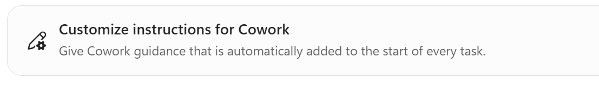

# 02 · Settings & Models

> Reference sheet for the "Getting Things Done with Copilot Cowork for HR Tasks" workshop.

Cowork gives you a few controls that shape *how* it works. You don't need to change them for every
task, but knowing what they do helps you get better results for HR work.

## Model picker

Cowork lets you **choose the model** for a task, or **let Cowork decide** (the default). Different
models trade off speed, depth, and cost.

- **Let Cowork decide** — recommended default. Cowork selects a suitable model for the task.
- **Pick a specific model** — use when you want more depth (e.g., nuanced policy drafting) or faster,
  lighter responses (e.g., a quick reply).
- Cowork can optionally use **Anthropic models as a subprocessor** in addition to other models.
  Which specific models appear in your picker depends on what's enabled in your tenant.

> **Tip for HR:** For sensitive or nuanced writing (a delicate employee message, a policy summary),
> a higher-capability model + higher reasoning effort produces more careful output. For quick,
> routine drafts, the default is fine.

## Reasoning effort level

The **reasoning effort** setting controls how Cowork balances **quality, speed, and cost**.

- **Lower effort** — faster and cheaper; good for simple, routine tasks.
- **Higher effort** — slower and more thorough; good for multi-step research, analysis, or careful
  drafting.

Because Cowork runs on **usage-based billing**, higher effort and heavier models generally consume
more. Match the effort to the task.

## Custom instructions

**Custom instructions** are guidance Cowork **automatically adds to the start of every task**. Set them
once on **Customize → Preferences → Customize instructions for Cowork** (you do this in Setup step D).
Great for encoding how your HR team likes to work.

Set them once and they carry across sessions — no need to repeat yourself in every prompt. They're
personal to you, support rich text (type **/** to reference a skill, file, person, or meeting), and can
be up to about **20 KB**. Keep them short and consistent: Cowork includes them in every task, so long
or conflicting instructions leave less room for the task itself.
([Microsoft Learn](https://learn.microsoft.com/microsoft-365/copilot/cowork/cowork-customize#custom-instructions-in-cowork))

### Sample custom instructions to paste

Pick **one** that fits your role, replace the `{placeholders}`, and paste it into **Customize →
Preferences → Customize instructions for Cowork**. Don't stack several: overlapping rules can
conflict. Use sample 1 during the workshop.

**1. Workshop default (use this today)**
> I work in HR at Zava. Write in a warm, professional, inclusive tone suitable for employee
> communications. When you answer a policy or benefits question, cite the source document and add
> "Policies can change — please confirm with HR." Save emails and messages as drafts for me to
> review; during this workshop, never send anything to anyone but me. Unless I ask you to use my
> mail, calendar, or Teams, use only the Zava sample files in my OneDrive folder
> Documents/ai_hr_cowork_workshop, and never copy real employee personal data into files or drafts.

**2. HR generalist / HR business partner**
> I'm an HR business partner supporting {teams or business units}. Lead with the answer, then up to
> five bullets, in plain language a manager could forward without editing. Flag anything that touches
> pay, performance, discipline, leave, or legal risk, and suggest I check with Employee Relations or
> Legal. Never make or recommend a decision about an individual employee; give me options and the
> policy that applies. Save every email and Teams message as a draft for me to review.

**3. Recruiter / talent acquisition**
> I'm a recruiter hiring for {roles}. Use inclusive, bias-free language in job posts and candidate
> emails: no gendered terms, and no degree or years-of-experience requirements unless I say they're
> essential. Keep candidate emails under 150 words, warm, and specific, with one clear next step.
> When scheduling interviews, offer times between 9:00 and 16:00 {my time zone} and always add a
> Teams link. Never share one candidate's details with another. Save candidate messages as drafts.

**4. HR operations and reporting**
> When you analyze HR data, show the numbers in a table first, then three takeaways. Name the source
> file and date range, and call out any rows you excluded or couldn't read. Round percentages to one
> decimal place. Put anything with formulas in Excel. Never overwrite my source files; save new
> versions with today's date in the file name. Don't include employee names in summaries unless I
> ask for them.

**5. Employee communications**
> For messages to all employees: aim for an 8th-grade reading level, open with what's changing and
> when, then what employees need to do, then where to get help ({HR help mailbox or portal}). Keep
> email subject lines under eight words. Offer a shorter Teams version as well. Use our brand voice:
> clear, warm, and inclusive, with sentence-case headings and no exclamation marks.

**6. Formatting preferences (add to any of the above)**
> Use {US or UK} English spelling. In Word documents, start with a title and a one-paragraph summary,
> then sections with headings. In PowerPoint, use no more than five bullets per slide and put details
> in the speaker notes. Use tables for comparisons. Date format: {e.g., 1 Oct 2026}.

> **Tips:** reference a standing source with **/** (for example, type **/** and pick your benefits
> guide) so Cowork always grounds on it. Review your instructions every few weeks, and remove rules
> you no longer need.

## Personal skills

Also on the **Customize** page, you can add your own **personal (custom) skills** — reusable
instructions that teach Cowork to handle a recurring task consistently. This workshop builds one in
Exercise 4. See [05-custom-skill-guide.md](05-custom-skill-guide.md).

## Plugins

**Plugins** add **skills** and **connectors** to Cowork. Connectors link Cowork to systems outside
Microsoft 365 and can be MCP servers. Manage plugins in **Customize → Plugins**: installed plugins
have on/off toggles, and **Discover** lists plugins from the Microsoft 365 App Store. Plugin skills
appear alongside the built-in skills and activate automatically. HR examples include **Gusto**
(payroll and benefits) and **ZipRecruiter** (job listings). Availability depends on what your admin
approves. See [09-plugins.md](09-plugins.md) for more on HR plugins.

## Automations

**Automations** let Cowork run tasks on a schedule or in response to events:

- **Scheduled prompts** — run at a set time (e.g., "Every Monday at 8 AM, prepare a summary of open
  HR tickets").
- **Event-driven tasks** — run when something happens.

Manage them from the **Automations** page, which has two tabs:

- **Runs** — each past or upcoming run.
- **Manage schedules** — the schedule definitions (edit, pause, resume, delete).

You can also create a new schedule directly with **Create** on the Automations page.

## Image generation

Cowork can generate images on request (it uses the **ChatGPT Images 2.0** model), saving results to
your session and OneDrive output folder. Useful for simple visuals in HR comms or slides.

## Quick "what to adjust when" guide

| Situation | Suggested setting |
| --- | --- |
| Routine draft, quick reply | Default model, lower reasoning effort |
| Sensitive employee message | Higher-capability model, higher reasoning effort |
| Multi-source research | Higher reasoning effort (Deep Research skill) |
| Same preference every time | Encode it in **custom instructions** |
| Recurring weekly task | Set up an **Automation** |
