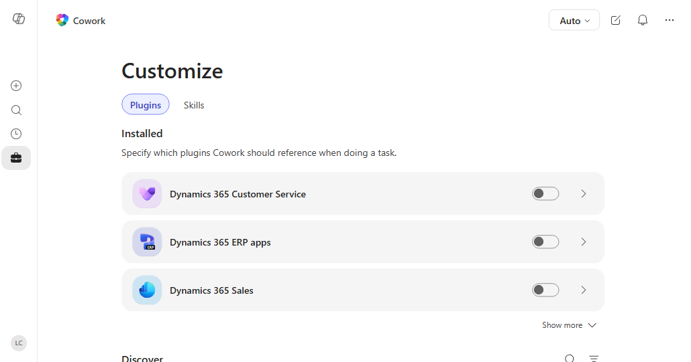

# 09 · Extend Cowork with HR Plugins (Self-study)

> Reference sheet for the "Getting Things Done with Copilot Cowork for HR Tasks" workshop.
> **Self-study, not part of the live session** (it's in the after-the-workshop pack). It shows how plugins connect Cowork to the HR
> systems you already use, and where you manage them on the **Customize** page.

## What a plugin is

A **plugin** is a package that adds new abilities to Cowork. It can contain:

- **Skills**: HR know-how that teaches Cowork how to do a type of work. Plugin skills work like
  built-in skills: Cowork activates them automatically and shows them as chips in the side panel.
- **Connectors**: links to **systems outside Microsoft 365**, such as payroll, recruiting, or your
  HR system, so Cowork can look things up or take actions there. Connectors can be **MCP (Model
  Context Protocol) servers**; Cowork discovers the server's tools automatically when they're needed.

## Where you manage plugins: Customize → Plugins



*Screenshot: Microsoft Learn, [Customize Copilot Cowork](https://learn.microsoft.com/microsoft-365/copilot/cowork/cowork-customize).
This tenant shows Dynamics 365 plugins; HR plugins such as Gusto or ZipRecruiter appear in the same
list once added. Your page may also show a **Preferences** tab, where custom instructions live.*

| Area | What it does |
| --- | --- |
| **Installed** | Plugins you or your admin added. Each has an **on/off toggle**, so you choose which plugins Cowork uses. |
| **Plugin detail page** (the arrow) | Shows the publisher, description, the **skills and connectors** it includes, and **what data it connects to**. You can remove plugins you added yourself. |
| **Discover** | Plugins available from the Microsoft 365 App Store, plus plugins you published or that were shared with you. Select **Add** to install one. |
| **Upload plugin** | Upload your own plugin package (a `.zip`), then **Share** it with **Only you** or **specific people** in your organization. |
| **Sources & Skills panel** (in a conversation) | Turn plugins on or off for the task in front of you, to keep results focused. |

## HR plugins you can use today

From Microsoft's published list of
[available plugins for Copilot Cowork](https://learn.microsoft.com/en-us/microsoft-365/copilot/cowork/cowork-available-plugins)
(checked October 1, 2026; the catalog keeps growing). What's available to **you** depends on what your
admin has approved; in Cowork, open **Add plugins** to see the current list for your organization.

| Plugin | What it brings to HR work in Cowork |
| --- | --- |
| **Gusto** | Payroll runs, employee records, benefits enrollment, tax filings, and time data |
| **ZipRecruiter** | Search job listings, e.g. to benchmark a role you're hiring for |
| **Dice.com** | Search tech job listings by keyword, location, and filters |
| **Cronofy MCP** | Schedule meetings using real-time, multi-person calendar availability; handy for interview panels |
| **Articulate** | Turn training ideas into build-ready course outlines for learning and development |
| **Your own HR plugin** | Your organization's HR skills plus an **MCP connector to your HR system** (HRIS), built and deployed by IT; see below |

> **⭐ Using SAP SuccessFactors?** There's **no SuccessFactors plugin** in the Cowork catalog yet (the
> only SAP entry, *enosix arnold*, covers SAP ERP orders and invoices, not HR). Three ways to bring
> SuccessFactors into your Microsoft 365 Copilot work today:
>
> 1. **Employee Self-Service agent + SAP SuccessFactors extension pack** (Microsoft 365 Copilot agent,
>    not a Cowork plugin): employees and managers read and update their own HR data, such as hire date,
>    job info, compensation, emergency contacts, and direct reports' details, in Copilot.
>    [Integrate SAP SuccessFactors with Employee Self-Service](https://learn.microsoft.com/en-us/microsoft-365/copilot/employee-self-service/sapsuccessfactors)
> 2. **A custom Cowork plugin**: IT packages HR skills with an **MCP connector** to SuccessFactors (for
>    example through an MCP gateway in front of the SuccessFactors APIs), the same pattern as the Zava
>    HRIS example below.
> 3. **Ask for one:** your admin can request a plugin in the Microsoft 365 admin center, or work with a
>    partner to build it.

## Example: payroll questions with an HR plugin

*Illustration only. The workshop tenant has no HR plugins installed.*

1. **Your admin deploys a payroll plugin** (for example, **Gusto**) to the HR team. It appears under
   **Customize → Plugins → Installed** with a **Managed by your organization** label; you didn't
   have to find or add it.
2. **Open its detail page** to see its skills and connectors and what payroll data it reaches.
3. **Connect once.** The first time Cowork uses the connector, select **Connect** and sign in to the
   payroll system with your own account.
4. **Ask Cowork**:
   > Which open tickets in `hr-tickets-sample.xlsx` are payroll issues? For each one, check the
   > employee's latest pay run in payroll, explain what happened, and draft a reply for me to review.
5. **Cowork joins the two sources.** For ticket **T-2008** (*"Overtime hours missing from my
   paycheck"*), it reads the ticket from the spreadsheet, checks the pay run through the plugin, and
   drafts an answer. It still pauses for your approval before anything is sent.

Without the plugin, you'd look the employee up in payroll, copy the details into the prompt, and
check the result by hand.

## For IT: your own HR system as an MCP plugin

Organizations can package **their own HR skills and an MCP server for their HR system** into a
custom plugin, upload it in **Customize → Plugins → Upload plugin**, test it, and then deploy it. A
plugin declares its MCP server in its manifest. This trimmed, fictional example follows the format
in Microsoft's documentation:

```json
"agentSkills": [ { "folder": "./skills/hr-policy-answer" } ],
"agentConnectors": [
  {
    "id": "zava-hris",
    "displayName": "Zava HR System",
    "description": "Remote MCP server for Zava employee, leave, and benefits data",
    "toolSource": {
      "remoteMcpServer": {
        "mcpServerUrl": "https://hris.zava.example/mcp",
        "authorization": { "type": "OAuthPluginVault", "referenceId": "<from Teams Dev Center>" }
      }
    }
  }
]
```

The `hr-policy-answer` skill you built in **Exercise 3** could ship inside a plugin like this, so the
whole HR team gets the skill **and** live HR data together. Details:
[Build plugins for Cowork](https://learn.microsoft.com/microsoft-365/copilot/cowork/cowork-plugin-development).

## Benefits for HR

- **One task across HR systems and Microsoft 365.** Combine payroll, recruiting, scheduling, or HRIS
  data with your email, calendar, and files in a single request.
- **Fewer swivel-chair hand-offs.** Cowork looks up and acts in the other system instead of you
  exporting data and pasting it into a prompt.
- **Consistent answers across the team.** A plugin can bundle HR skills so everyone follows the same
  process and format.
- **Governed by IT.** Admins approve and deploy plugins, decide who gets them, and see plugin activity
  in **Microsoft Purview audit logs**.
- **No extra access to people data.** A connector uses **your own sign-in**, so it can't reach any
  employee data you can't already reach, and no one can sign in on your behalf.
- **You stay in control.** Turn plugins on or off per conversation, and Cowork still asks for approval
  before sending, posting, or changing anything.

## Good to know

- **Admin approval:** most plugins must be approved by your IT admin before they appear. If you need
  one, ask your admin; they can request plugins in the Microsoft 365 admin center.
- **Admin-deployed plugins** appear automatically. You can't remove them, but you can turn them off
  for your own conversations.
- **One sign-in per connector:** after the first connection, Cowork remembers it until you or your
  admin revoke it.
- **Sensitive data:** payroll and employee records are confidential. Apply the same golden rules:
  draft, review, approve one action at a time, and only look up what your role allows.
- **In this workshop:** don't add or upload plugins in the shared attendee tenant. This is a slide or
  facilitator demo only.

**Learn more:** [Use plugins with Cowork](https://learn.microsoft.com/microsoft-365/copilot/cowork/cowork-plugins) ·
[Available plugins](https://learn.microsoft.com/microsoft-365/copilot/cowork/cowork-available-plugins) ·
[Manage plugins (admins)](https://learn.microsoft.com/microsoft-365/copilot/cowork/cowork-manage-plugins)
